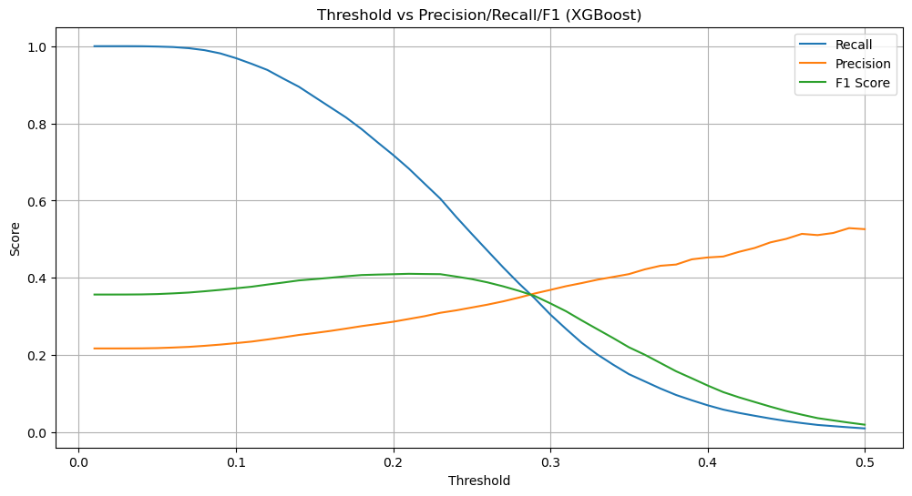
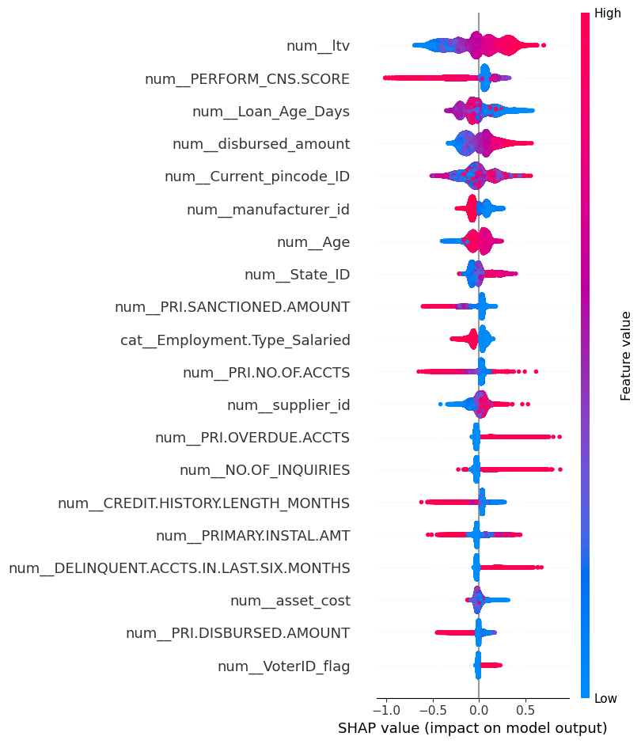
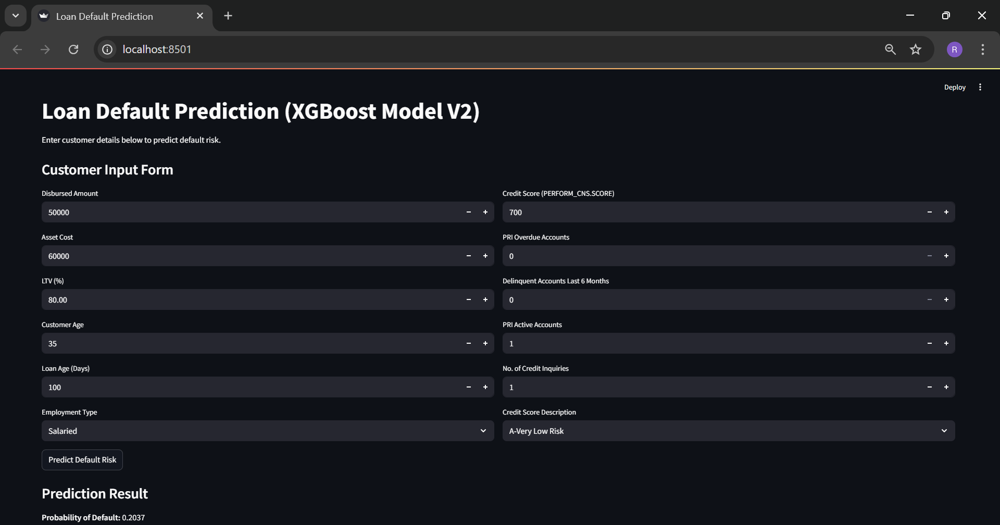

<p align="center">
  
</p>

<h1 align="center">Loan Default Prediction (Credit Risk Modeling)</h1>

<p align="center">
  End-to-End Machine Learning Pipeline | XGBoost | Cost Sensitive Learning | SHAP Explainability | Streamlit App
</p>

# Loan Default Prediction – Credit Risk Modeling (XGBoost)


## 1. Project Overview

This project predicts the probability of loan default using real-world credit data (233k+ rows, 41 features).  
It includes:

- Full preprocessing pipeline (imputation, encoding, scaling)
- XGBoost and LightGBM models
- Threshold tuning based on business cost
- Cost matrix optimization to reduce financial losses
- SHAP explainability
- Streamlit application for deployment

---

## 2. Project Structure

```
Project2_Loan_Default/
│
├── app/
│   └── app.py
│
├── models/
│   ├── loan_default_xgb_pipeline.pkl
│   ├── best_threshold.txt
│   └── feature_names.json
│
├── notebooks/
│   └── 01_eda_baseline.ipynb
│
├── src/
│   ├── preprocess.py
│   ├── train.py
│   ├── predict.py
│   └── evaluate.py
│
├── assets/
│   ├── threshold_curve.png
│   ├── business_cost_curve.png
│   └── shap_summary.png
│
└── README.md
```

---

## 3. Visual Insights

### Threshold Tuning Curve


### Business Cost Matrix Curve


### SHAP Summary Plot


### Streamlit App UI


---

## 4. Key Features

- End-to-end ML Pipeline using ColumnTransformer and Pipeline
- Handling missing values and categorical encoding
- XGBoost as primary model
- Business-driven threshold tuning instead of default 0.5
- Cost-sensitive decision optimization
- SHAP explainability for model transparency
- Streamlit UI for easy deployment

---

## 5. Model Performance

| Model | AUC |
|-------|-----|
| Logistic Regression | ~0.63 |
| LightGBM | ~0.66 |
| XGBoost | ~0.663 |

### Business Threshold Optimization
- Optimal threshold: **0.08**
- Minimum financial loss: **₹3.57 Crores**

---

## Model Versioning

### Model V1
- Trained on full 41 features
- Baseline AUC: ~0.663
- Business threshold: ~0.07
- Total minimum loss: ₹3.57 Cr (approx)
- Streamlit app had missing-column issues due to many unused features

### Model V2 (Current Production Model)
- Trained on **12 clean, high-signal features** only
- Better stability and lower overfitting
- Cleaner preprocessing pipeline
- Perfectly aligned with Streamlit inputs
- Business threshold recalculated
- Fully production-ready

**V2 Model Files**
```
models/
   loan_default_xgb_pipeline_v2.pkl
   best_threshold_v2.txt
   final_features.json
```

**Why V2 is Better**
- Removes noisy or irrelevant columns
- Matches real-world credit risk modeling practices
- Faster inference in Streamlit
- No feature mismatch errors
- More interpretable for business teams

---

## 6. Run Streamlit App

```
cd app
streamlit run app.py
```

---

## 7. Making Predictions (Example)

```
prob = model.predict_proba(input_df)[:, 1][0]
final_prediction = int(prob >= BEST_THRESHOLD)
```

---

## 8. Business Insights

- High LTV increases default probability  
- Low credit score strongly indicates risk  
- High number of recent enquiries is a key defaulter signal  
- Short credit history increases risk  
- Overdue and delinquent accounts are highly predictive  
- Salaried customers generally show lower risk than self-employed  

---

## 9. Future Improvements

- Hyperparameter tuning with Optuna
- Ensemble of XGBoost + LightGBM
- Deploy Streamlit app on Streamlit Cloud
- Add automated retraining pipeline
- Add monitoring dashboard

---

## 10. Author

**Veera Bokkisam**  
Machine Learning Engineer – Finance Domain

---
## ⭐ If you found this project useful, please ⭐ star the repo! 


---
